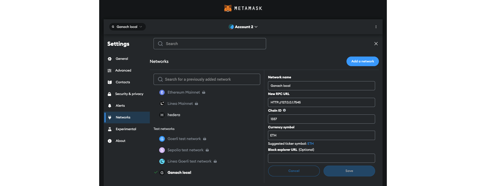

# Ticketing System Decentralized App

This is a decentralized ticketing app which host a number of events. Each event has a limited number of tickets which can be bought using a decentralized wallet.

This application hosts three different entities as far as payment is concerned:

- **Event Organizers**: The ones who will host an event.
- **Site Owner/Middle Man**: The one who owns the site and provides a gateway for Organizers and participants to connect.
- **Participants**: The one who pays for the event ticket in order to attend it.

> By default the Middle Man is set to have 20% share from every ticket sold but that setting can be changed from within the smart contract named as `EventManagement.sol`. Smart contract is itself explained in detail in the [contracts/EventManagement.md](/contracts/EventManagement.md)

## Technologies

- node.js `16.20.2`
- react.js `18.2.0`
- vite.js `4.4.5`
- web3.js `4.2.2`
- truffle `5.11.5`
- npm `8.19.4`

## Installation

### Deploy The Contract

1. Install dependencies using `npm install` in the root directory.
2. Compile the contract located in `contracts/EventManagement.sol` using `npm run compile`.
3. Make sure that truffle configuration for deploying smart contract is correct inside `truffle-config.js`.
```json
    ...
    networks: {
        development: {
            host: "127.0.0.1",     // Localhost (default: none)
            port: 7545,            // Ethereum port (default: none)
            network_id: "*",       // Any network (default: none)
        }
    }
    ...
```
4. Make sure the solidity compiler version matches the `pragma` statement inside your `contracts/EventManagement.sol` in `truffle-config.js`.
```json
    ...
    compilers: {
        solc: {
        version: "0.8.11",      // Fetch exact version from solc-bin (default: truffle's version)
        ...
    }
    ...
```
5. Deploy the compiled contract using `npm run deploy`.

> **Alternate Deploy Method**
>
> You can also use [Remix IDE](https://remix.ethereum.org/) to deploy the smart contract.

### Populate `.env` Variables

1. Rename `.env.example` to `.env` inside `ticketing_system/` folder.
```
VITE_ACCOUNT_PUBLIC_ADDRESS --> address of the wallet which deployed the smart contract (owner of the contract)
VITE_SMART_CONTRACT_ADDRESS --> address of the deployed smart contract
```

### Connect MetaMask

1. Download [MetaMask](https://metamask.io/download/)
2. Add or select network with the same configuration you used to deploy the smart contract with.

3. Import your wallet account and select it as "active".

### Run The App

1. Go to `ticketing_system/` and install dependencies using `npm install`.
2. Run the app using `npm run dev`.

